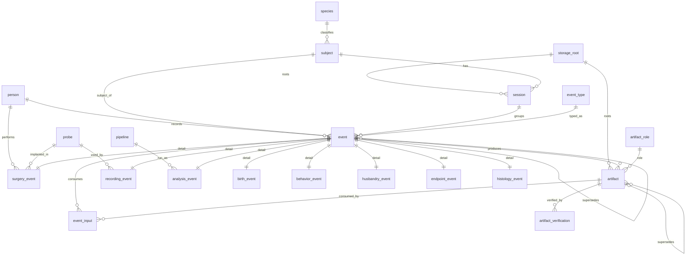

# Database Design — Ephys Metadata System

This document specifies the PostgreSQL schema that implements the append-only
event log, artifact index, and provenance DAG described in
[overview.md](overview.md). It is the authoritative reference for the schema:
an ER overview, a table-by-table rationale, and the recursive lineage query. The
complete runnable DDL lives alongside it in [schema.sql](schema.sql).

- **Target:** PostgreSQL 14+ (schema named `ephys`).
- **Portability:** the schema degrades cleanly to SQLite for single-writer use;
  the deltas are listed in [Portability](#portability-notes).

---

## 1. Overview & ER diagram

The schema has four layers:

1. **Reference tables** — mostly-static vocabulary and registries (`person`,
   `probe`, `pipeline`, `storage_root`, `species`, and the categorical lookups
   `event_type` / `artifact_role` / `acquisition_system`).
2. **Dimensions** — the durable identities the events hang off: `subject` (the
   animal) and `session` (a recording period, 1:1 with a NAS folder).
3. **Events** — a base `event` table plus one typed detail table per event type
   (class-table inheritance). Events are immutable and append-only.
4. **Artifacts & provenance** — `artifact` rows point at the event that produced
   them; `event_input` records which artifacts an event consumed. Together these
   two edge types form the provenance DAG.



---

## 2. Conventions

- **Identifiers.** `event` and `artifact` use `uuid` primary keys defaulting to
  `gen_random_uuid()`. UUIDs are client-generatable, so the MATLAB `EphysDB`
  layer can mint IDs offline and batch-insert without a round-trip, and two
  workstations never collide. `subject` uses its human-meaningful lab ID as a
  natural text primary key; lookup tables use short `code` primary keys.
- **Two clocks.** Every event carries `occurred_at` (when the fact happened in
  the lab) *and* `recorded_at` (when the row was inserted). They differ whenever
  metadata is entered after the fact, which is the norm.
- **Categoricals are lookup tables, not native enums.** `event_type`,
  `artifact_role`, and `acquisition_system` are small tables referenced by FK.
  This keeps the vocabulary extensible without `ALTER TYPE`, and it is the
  portable choice for SQLite. Tiny fixed sets that will never grow (`sex`,
  `checksum_algo`, `modality`, `status`) use `CHECK` constraints instead.
- **Extensibility.** The base `event` and `artifact` tables each carry an
  `attributes jsonb` column for ad-hoc fields that do not warrant a schema
  change. Structured, frequently-queried data gets real columns
  (`analysis_event.parameters`, `recording_event.hardware_config`,
  `probe.geometry` are the JSONB exceptions where the shape is genuinely open).
- **Timestamps** are `timestamptz`; store UTC. **Text** uses `text`, not
  `varchar(n)`.
- **Everything is schema-qualified** (`ephys.<table>`) so the DDL is
  copy-paste-safe regardless of the caller's `search_path`.

---

## 3. Table reference

### 3.1 Reference tables

| Table | Purpose |
|---|---|
| `person` | Lab members. Referenced by `event.recorded_by`, `surgery_event.surgeon_id`, and every `*_by` column. |
| `storage_root` | Named NAS roots. Paths elsewhere are stored **relative** to a root so they resolve across machines/OSes; the per-OS mount point lives in client config, not the DB. |
| `species` | Species vocabulary for `subject`. |
| `probe` | Electrode/probe device registry, including channel geometry as JSONB. Referenced by surgeries (implant) and recordings (acquisition device). |
| `pipeline` | Analysis pipeline registry (name + repo). Each *run* pins its own `code_version`/`parameters` on the `analysis_event`, so this table stays stable while runs vary. |
| `event_type` | The eight event-type codes; the discriminator that selects a detail table. |
| `artifact_role` | Role a file plays (`raw`, `spikes`, `lfp`, `video`, `figure`, …). |
| `acquisition_system` | Acquisition software (`intan_rhx`, `open_ephys`). |

### 3.2 Dimensions

**`subject`** — the animal, keyed by lab ID. Its identity is independent of any
birth: an acquired animal has a `subject` row with `date_of_birth` possibly null
and no `birth_event`. Descriptive fields (`species_code`, `sex`, `strain`,
`genotype`, `source`) live here because they are stable identity attributes;
anything that *happens* to the subject over time is an event.

**`session`** — a recording period mapping 1:1 to a NAS folder `subject/session`.
`UNIQUE(subject_id, label)` and `UNIQUE(storage_root_id, relative_path)` enforce
that mapping. Recording and behavior events belong to a session; births,
surgeries, and husbandry do not.

### 3.3 Events (class-table inheritance)

**`event`** is the base row shared by all event types. It holds the common
columns — type, subject, session, the two clocks, recorder, correction link,
notes, and the `attributes` JSONB — and nothing type-specific.

Type correctness is enforced **declaratively**, not by trigger: `event` carries
`UNIQUE(event_id, event_type)`, and every detail table pins its own type with a
`CHECK` plus a composite foreign key `(event_id, event_type) →
event(event_id, event_type)`. A `recording_event` row therefore *cannot* attach
to an event whose type is `birth`.

Detail tables and their type-specific columns:

| Detail table | Key columns |
|---|---|
| `birth_event` | `dam_subject_id`, `sire_subject_id`, `litter_id`, `birth_weight_g` (newborn = base `subject_id`) |
| `surgery_event` | `procedure`, `surgeon_id`, `anesthesia`, `target_region`, `hemisphere`, stereotax `ap/ml/dv_mm`, `probe_id`, `outcome` |
| `recording_event` | `acquisition_system_code`, `probe_id`, `modality`, `sample_rate_hz`, `n_channels`, `duration_s`, `stimulus_protocol`, `hardware_config` |
| `behavior_event` | `task`, `paradigm`, `stage`, `trials_completed`, `performance`, `reward` |
| `husbandry_event` | `measure`, `weight_g`, `water_ml`, `health_status` |
| `endpoint_event` | `method`, `perfusion_fixative`, `tissue_collected`, `disposition` |
| `histology_event` | `technique`, `target_region`, `stain`, `microscope` |
| `analysis_event` | `pipeline_id`, `pipeline_name`, `code_version`, `parameters`, `environment`, `started_at`, `finished_at`, `status` |

Two rules that need a trigger rather than a constraint:

- **Recordings require a session.** `trg_require_session_for_recording` rejects a
  `recording_event` whose base `event.session_id` is null.
- **Immutability.** `event`, every `*_event` detail table, `artifact`, and
  `event_input` reject `UPDATE`/`DELETE` (see §4).

**Video.** Behavioral video is not a separate event type; it is an `artifact`
with `role = 'video'`. A recording that is primarily video sets
`recording_event.modality = 'video'` (or `'multimodal'` when video accompanies
ephys), and the `.mp4`/`.avi` files register as artifacts of that event.

### 3.4 Artifacts & provenance

**`artifact`** — one row per file on the NAS, referenced by
`(storage_root_id, relative_path)` plus a `checksum`. It always points at the
`produced_by_event_id` that created it. `UNIQUE(storage_root_id, relative_path,
checksum)` dedupes re-registration of the same bytes while allowing a
re-derived file at the same path (new bytes) to register as a *new* artifact,
optionally linked to the old one via `supersedes`.

**`event_input`** — the second edge type: the artifacts an event consumed. It is
general (any event may consume artifacts) but in practice is populated by
analysis events. `artifact.produced_by_event_id` + `event_input` are the two
edges of the provenance DAG.

**`artifact_verification`** — an *append-only log* of integrity checks. Because
`artifact` rows are immutable, periodic checksum re-verification is recorded here
(`ok` / `missing` / `mismatch`) instead of mutating the artifact.

---

## 4. Immutability & corrections

Events are facts; facts do not change. The schema forbids `UPDATE` and `DELETE`
on all event and artifact tables via `fn_forbid_mutation()`. A mistake is fixed
by **appending a superseding row** whose `supersedes` points at the row it
replaces. The partial unique index on `supersedes` keeps history *linear* — a
given row can be corrected by at most one successor, so there are no forks.

A row is **active** when nothing supersedes it. The `event_active` and
`artifact_active` views encapsulate that filter so callers never hand-roll it.

**Worked example — a recording logged with the wrong sample rate:**

```sql
-- Original (wrong: 20 kHz)
INSERT INTO ephys.event (event_id, event_type, subject_id, session_id, occurred_at)
VALUES ('11111111-1111-1111-1111-111111111111', 'recording', 'GERB042', :sess, now());
INSERT INTO ephys.recording_event (event_id, acquisition_system_code, sample_rate_hz, n_channels)
VALUES ('11111111-1111-1111-1111-111111111111', 'intan_rhx', 20000, 64);

-- Correction (right: 30 kHz) — supersedes the original, original row is retained
INSERT INTO ephys.event (event_id, event_type, subject_id, session_id, occurred_at, supersedes)
VALUES ('22222222-2222-2222-2222-222222222222', 'recording', 'GERB042', :sess, now(),
        '11111111-1111-1111-1111-111111111111');
INSERT INTO ephys.recording_event (event_id, acquisition_system_code, sample_rate_hz, n_channels)
VALUES ('22222222-2222-2222-2222-222222222222', 'intan_rhx', 30000, 64);

-- event_active now shows only the 30 kHz row; the audit trail keeps both.
SELECT event_id, sample_rate_hz
FROM ephys.event_active e JOIN ephys.recording_event r USING (event_id)
WHERE e.session_id = :sess;
```

---

## 5. Provenance & the lineage query

Provenance is the DAG of `event → artifact → analysis → artifact`. Upstream
lineage of an artifact answers "everything that contributed to producing this
file": the artifact was produced by an event, that event consumed input
artifacts, each of which was produced by an earlier event, and so on.

`fn_artifact_lineage(artifact_id, 'up'|'down')` walks it with a recursive CTE
(depth-guarded for safety). Ancestors:

```sql
WITH RECURSIVE lin AS (
    SELECT 0 AS depth, a.produced_by_event_id AS event_id, a.artifact_id
    FROM ephys.artifact a
    WHERE a.artifact_id = :target
  UNION
    SELECT l.depth + 1, ain.produced_by_event_id, ain.artifact_id
    FROM lin l
    JOIN ephys.event_input ei  ON ei.event_id = l.event_id
    JOIN ephys.artifact    ain ON ain.artifact_id = ei.artifact_id
    WHERE l.depth < 64
)
SELECT * FROM lin ORDER BY depth;
```

The `provenance_edge` view exposes both edge types as a uniform edge list for
graph tooling.

---

## 6. The DDL

The full, runnable DDL is **[schema.sql](schema.sql)** — the canonical schema,
kept as a single source of truth so nothing drifts from a copy. Apply it to a
fresh database:

```bash
createdb ephys && psql -d ephys -f design_docs/schema.sql
```

`schema.sql` creates everything described above, in dependency order: the `ephys`
schema; the reference/lookup tables; the `subject` / `session` dimensions; the
base `event` and its eight detail tables; `artifact` / `event_input` /
`artifact_verification`; all indexes; the immutability and
`require-session-for-recording` triggers; the `event_active` / `artifact_active`
/ `provenance_edge` / `subject_current` views; `fn_artifact_lineage()`; and the
seed vocabulary. It targets PostgreSQL 14+ (`gen_random_uuid()` is in core since
PG 13; a `pgcrypto` fallback line is included for older servers).

---

## 7. Portability notes

The schema is designed for PostgreSQL. For single-writer SQLite use, the deltas
are:

| Feature | PostgreSQL | SQLite equivalent |
|---|---|---|
| Primary-key generation | `uuid DEFAULT gen_random_uuid()` | app-generated UUID stored as `text` |
| `timestamptz` | native | ISO-8601 `text` (store UTC) |
| `jsonb` | native, GIN-indexable | `text` via the JSON1 extension (no GIN) |
| Immutability | `BEFORE UPDATE OR DELETE` triggers | equivalent `BEFORE` triggers with `RAISE(ABORT, …)` |
| Identity columns | `GENERATED ALWAYS AS IDENTITY` | `INTEGER PRIMARY KEY AUTOINCREMENT` |
| `LATERAL` subqueries | native | correlated subqueries in `SELECT` |

The event/artifact/provenance model itself is unchanged; only these
type/idiom substitutions apply.

---

## 8. Related documents

- [overview.md](overview.md) — purpose, philosophy, and data flow.
- [schema.sql](schema.sql) — the canonical, runnable DDL.
- `for-coders.md` *(planned)* — MATLAB versions, JDBC driver, and connection
  details for the `EphysDB` class.
