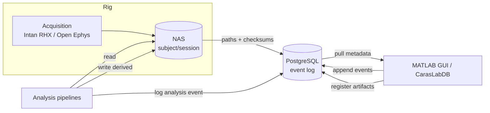

# Lab Metadata System — Overview

---

## Purpose

A metadata and provenance layer for an extracellular electrophysiology lab. The
system records *what happened* (births, surgeries, recordings, analyses) as an
append-only log and treats files on the NAS as artifacts produced by those
events. Raw and derived data are never the source of truth about the experiment;
the event log is.

Design goals:

- **Provenance.** Every derived file traces back through the analysis that
  produced it, its inputs, and the recording and subject it came from.
- **Reproducibility.** Analysis events carry the pipeline name, code version,
  parameters, and input artifacts needed to rerun them.
- **Auditability.** Events are immutable. Mistakes are corrected by appending a
  superseding event, not by editing history.

## Design philosophy: events, not files

The schema is organized around immutable events rather than around files.

- An **event** is a fact that occurred at a point in time (a birth, a surgery, a
  recording, an analysis run). Events are append-only.
- An **artifact** is a file produced by an event, referenced by its path on the
  NAS plus a checksum. Artifacts are metadata rows; the bytes live on the NAS.
- **Provenance** is the directed acyclic graph formed by events producing
  artifacts and analysis events consuming artifacts to produce new ones.

A file being renamed, moved, or re-derived does not change what happened in the
lab. Separating the two makes provenance tractable and makes reruns a matter of
reading an analysis event rather than reverse-engineering a folder.

## Components

| Component | Role |
|---|---|
| PostgreSQL database | Append-only event log, artifact index, provenance graph |
| NAS storage | Actual data, laid out as `subject/session/...` |
| MATLAB class (`CarasLabDB`) | Programmatic push/pull between MATLAB and the database |
| MATLAB App Designer GUI (`@CarasLabDBApp`) | Interactive metadata entry and browsing for the lab |
| Web dashboard (`web/lab-dashboard.html`) | Standalone, offline HTML/JS visualization of the data model, rendered from in-page synthetic data |
| Live dashboard (`web/live/`) | The same UI backed by the real database through a small `/api/data` server |
| MCP server (`mcp-server/`) | Read-only Model Context Protocol server giving an LLM agent typed `get*` query tools over the schema |

MATLAB target: R2025a or newer, with the Database Toolbox. The class connects
through the toolbox's **native `postgresql()`** interface, so no ODBC DSN and no
JDBC driver `.jar` need to be installed or configured. See
[Database design](database-design.md) for the table-by-table model and
[MCP server](mcp-server.md) for the agent-facing interface.

## Data flow

## Core concepts

- **Subject.** The animal, identified by a lab ID. Identity is independent of
  birth: an acquired animal has a subject row but may have no birth event.
- **Session.** A recording period, mapping one-to-one to a NAS folder
  (`subject/session`). Groups the recording events of that period.
- **Correction.** An event that supersedes an earlier one via a `supersedes`
  link. The original row is retained; queries filter to the active version.
- **Provenance DAG.** The graph of `event → artifact → analysis → artifact`.
  See the recursive lineage query in [Database design](database-design.md).

## Scope and assumptions

- One shared database serves the lab; PostgreSQL is assumed for concurrent
  multi-user access. The schema is portable; SQLite is viable only for
  single-writer use.
- The NAS is mounted on each workstation. Artifact paths are stored relative to
  a configured NAS root so they resolve across machines and OSes.
- Acquisition software (Intan RHX, Open Ephys) and analysis pipelines (e.g.
  Kilosort) are external. The system records their outputs and parameters; it
  does not run them.

